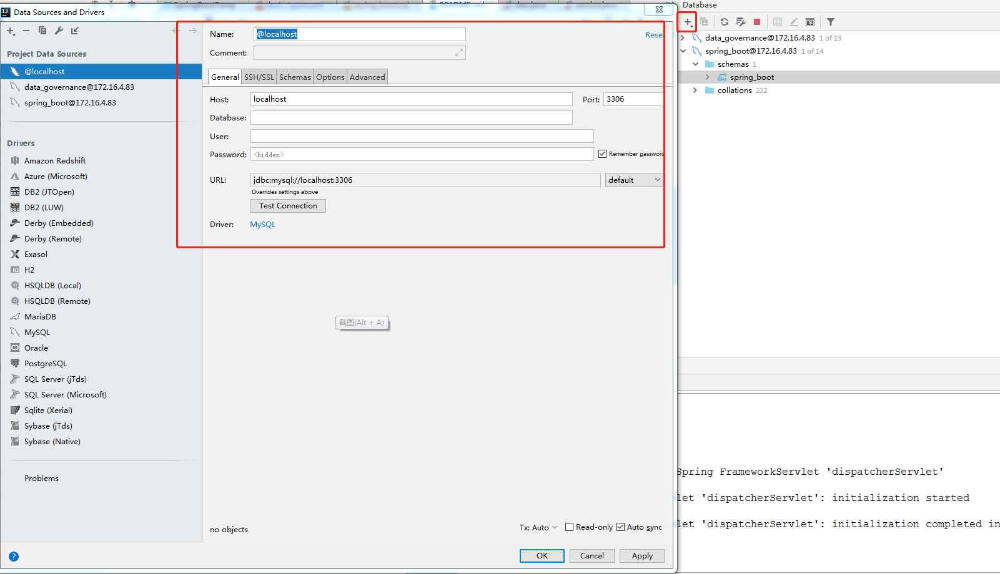

### Spring Boot MyBatis 框架模板
### Easy Code 代码自动生成 使用步骤：

#### 1：插件环境
##### idea 插件安装：

#### 2：代码工程结构，主要是包路径：
#### 自己可以重定义结构，需要编辑Easy Code 模板

#### 3：pom.xml 依赖
Easy Code 现有模板，相关maven 依赖 见 SpringBootTemp/doc/maven/pom.xml

#### 4:建立数据库连接

#### 5:Easy Code 模板定义

#### Easy Code 模板 数据库类型 映射Java 类型配置

#### Easy Code 模板配置，将工程的模板 逐一copy 插件如图位置

#### 模板配置完 可以点击右上角如图预览编译后的 

#### 6: 代码生成

#### 7: 结果呈现

 
     
